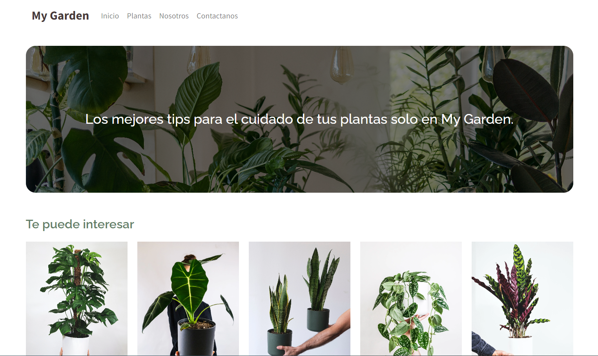
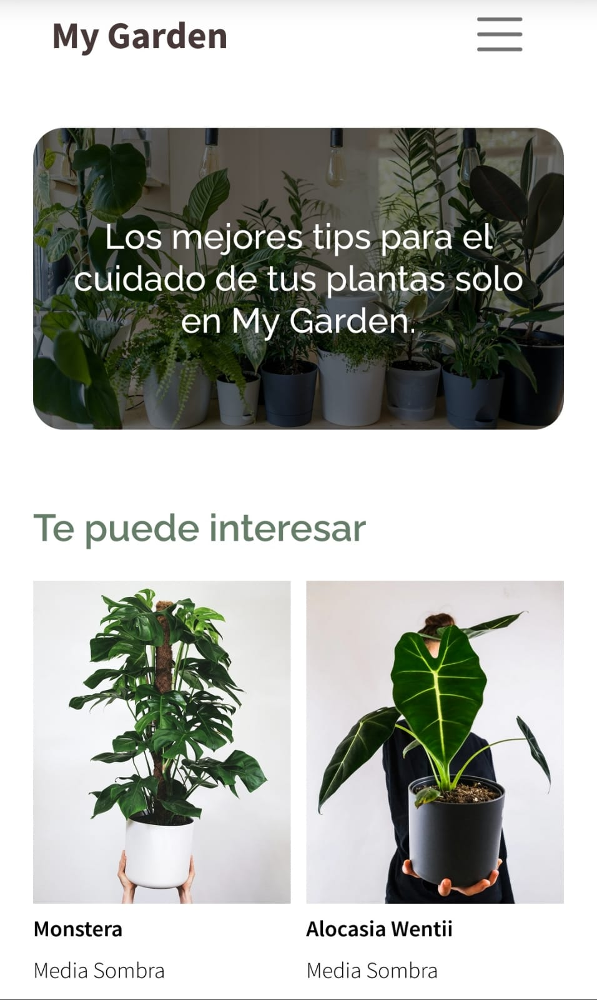

<h1 align="center">My Garden</h1>

  <h3>
    <a href="https://mygardenic.netlify.app/">
      Demostración
    </a>
  </h3>

## Tabla de contenido

- [Vista Previa](#vista-previa)
  - [Realizada con](#realizado-con)
- [Descripción](#caracteristicas)
- [Contacto](#contacto)

## Vista Previa

### Realizado con

- [HTML]()
- [CSS]()
- [JS]()
- [AngularJS]()

## Caracteristicas

## Contacto

- GitHub [@JAMESBLUM](https://github.com/JAMESBLUM)
- Instagram [@_edrv__](https://www.instagram.com/_edrv_/)
